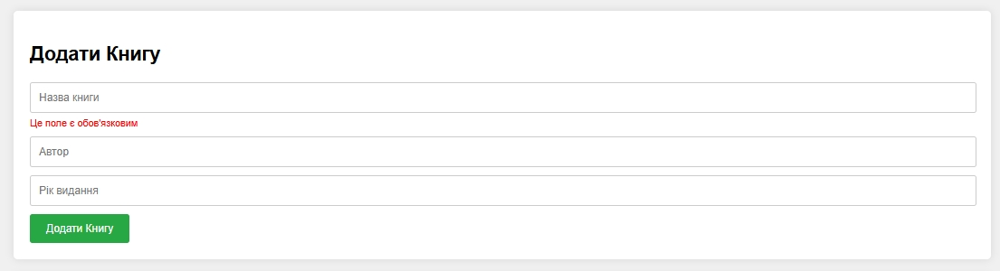
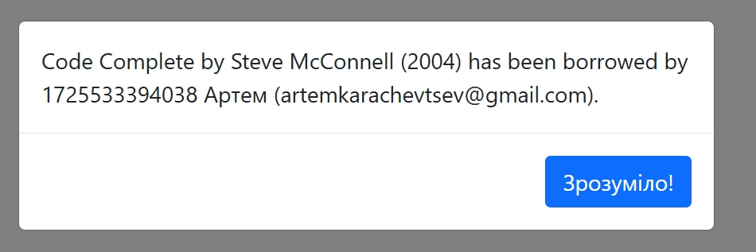

= Лабораторна робота №3

*Тема:* розробка застосунку управління бібліотекою.

*Мета:* розробити застосунок для управління бібліотекою, яка дозволяє вести облік книг та користувачів, а також здійснювати операції з позичання та повернення книг.
Програма має бути реалізована з використанням можливостей TypeScript, таких як класи, інтерфейси, generics, модулі та простори імен.

*Вимоги до звіту:*

. Дотримання TypeScript-типізації є обов'язковим;
. Використовувати класи та інтерфейси;
. Використовувати Generics;
. Використовувати модулі та простір імен;
. Для стилізації використовувати (https://getbootstrap.com/docs/5.3/getting-started/introduction/[Bootstrap]);
. Програма має бути модульною та легко розширюваною;
. Код має бути читабельним і добре організованим;
. Код повинен бути на github.

== Практична частина

=== Обовязкові завдання:

. Додати робочі файли для розробки (директорія lab-app) в свій локальний репозиторій.
. Ознайомитись з архітектурою проєкту.
+

. Встановити необхідні залежності для виконання лабораторної роботи.
. Запуск серверу `npm run start`.
Це відкриє index.html у браузері за адресою http://localhost:9000. Для запуску локального серверу можете використовувати інші відомі інструменти.
. В директорії lib знаходяться код ui фреймворку Bootstrap.
. В директорії design знаходяться приблизаний вигляд ui застосунку.
. Реалізувати вигляд ui застосунку з використанням ui фреймворку Bootstrap.
+

+

. Реалізувати класи та інтерфейси для книг.
Додайте методи для доступу до властивостей книги.
. Реалізувати класи та інтерфейси для користувачів.
Додайте методи для доступу до властивостей користувача.
. Реалізувати клас Library, який буде використовувати Generics для управління колекцією об'єктів типу T. Додайте до класу методи для додавання, видалення та пошуку об'єктів у колекції.
. Реалізувати клас Storage, який буде зберігати, видаляти та очищати LocalStorage.
. Розбийте вашу програму на кілька модулів: models, services, utils і т.д. У кожному модулі реалізуйте відповідні класи та функції.
Використовуйте простори імен для організації коду всередині модулів, якщо це необхідно.
. Реалізуйте функції для позичання книги та повернення книги.
Ці функції повинні змінювати стан книги (наприклад, позначати, що вона вже взята).
+

. Додайте валідацію введених даних при створенні книг та користувачів.
Всі поля повинні бути обов'язковими для заповнення.
Поле з id користувача - тільки цифри.
Поле "Рік видання" - тільки цифри, додати регулярку на перевірку що це має бути рік.
Виводити клієнту відповідні помилки.
+

. Реалізуйте систему сповіщень, яка буде інформувати користувача про бажання позичати книгу, успішне позичання або повернення книги.
Кожен юзер може позичити не більше 3-х книг.
Якщо юзер захоче обрати четверту, вивести йому відповідне повідомлення.
+

. Всі введені дані зберігати в LocalStorage, тобто при перезавантаженні сторінки, списки повинні зберігатись.

=== Додаткові завдання:

. Реалізувати функцію для пошуку книг за автором або назвою.
. Реалізувати видалення книг, юзерів.
. Реалізувати пагінацію для списків книг та авторів (Наприклад, якщо список книг 40, то виводити 5 книг на сторінку).
. Налаштувати webpack.config для роботи з стилями.
. Зробити деплой на gh-pages.