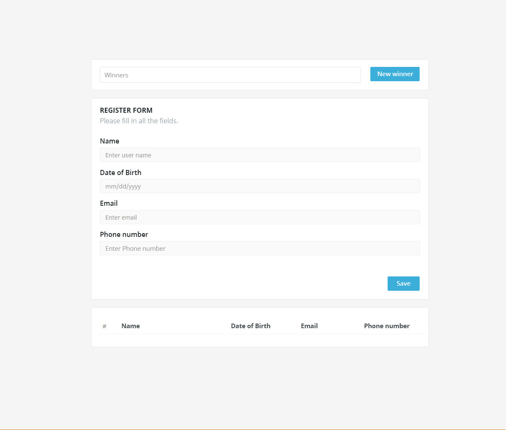
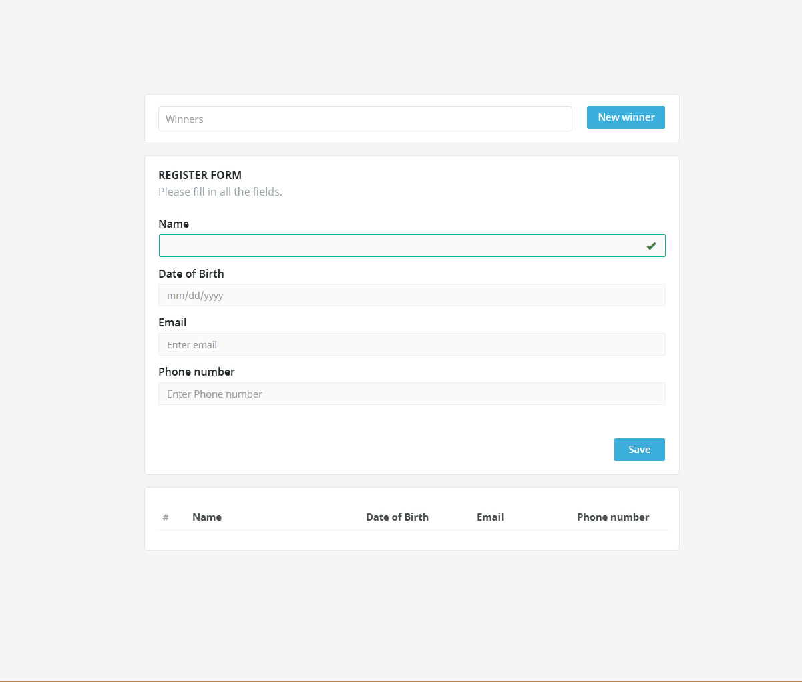
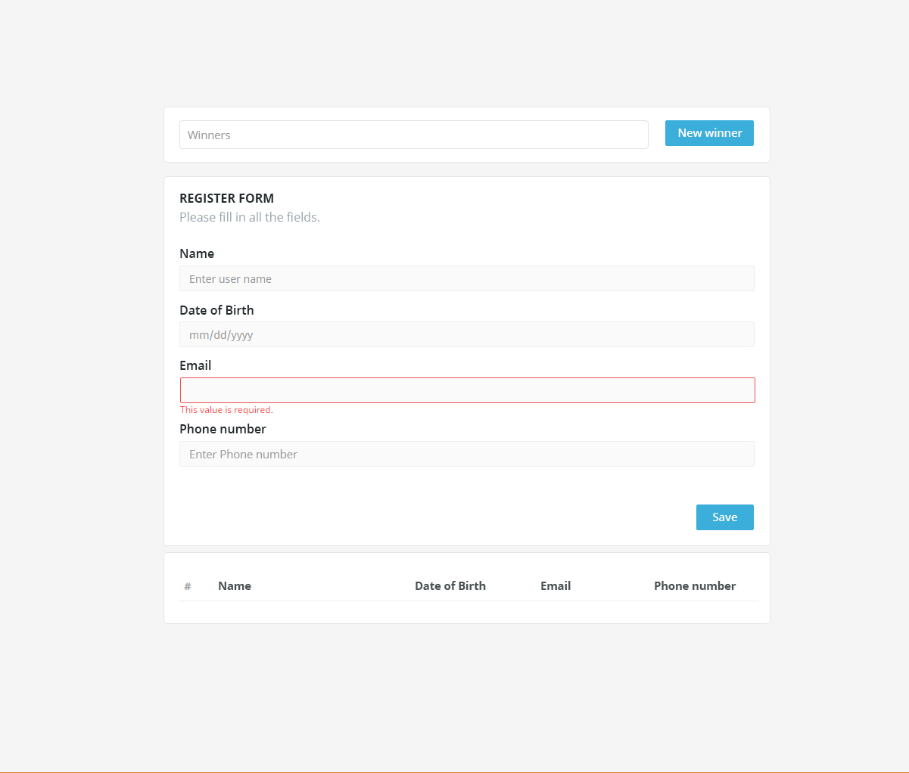
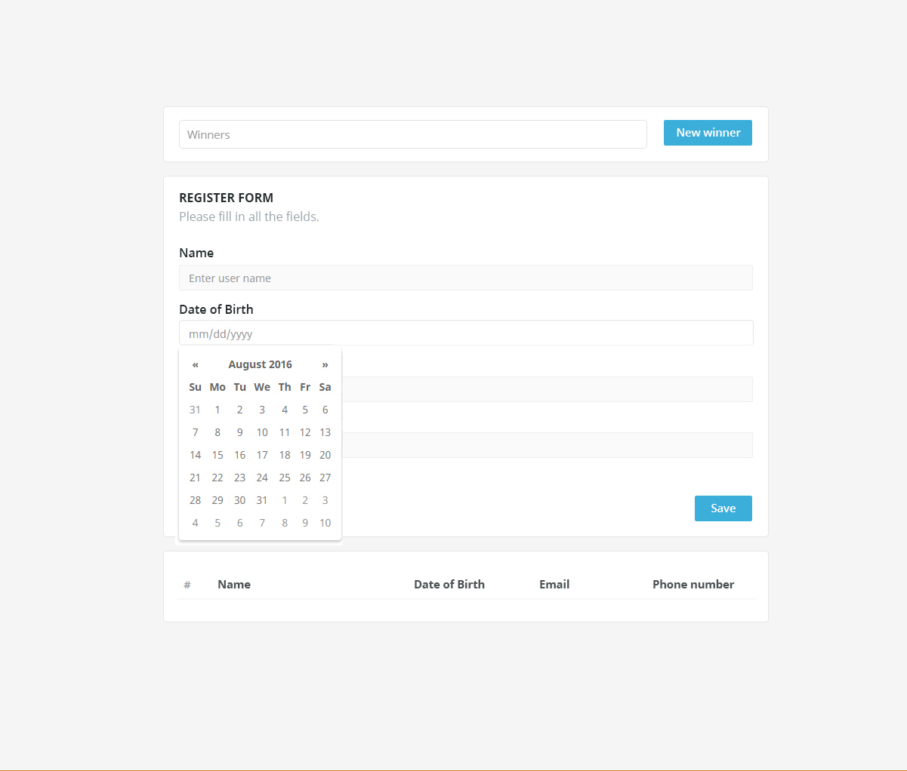
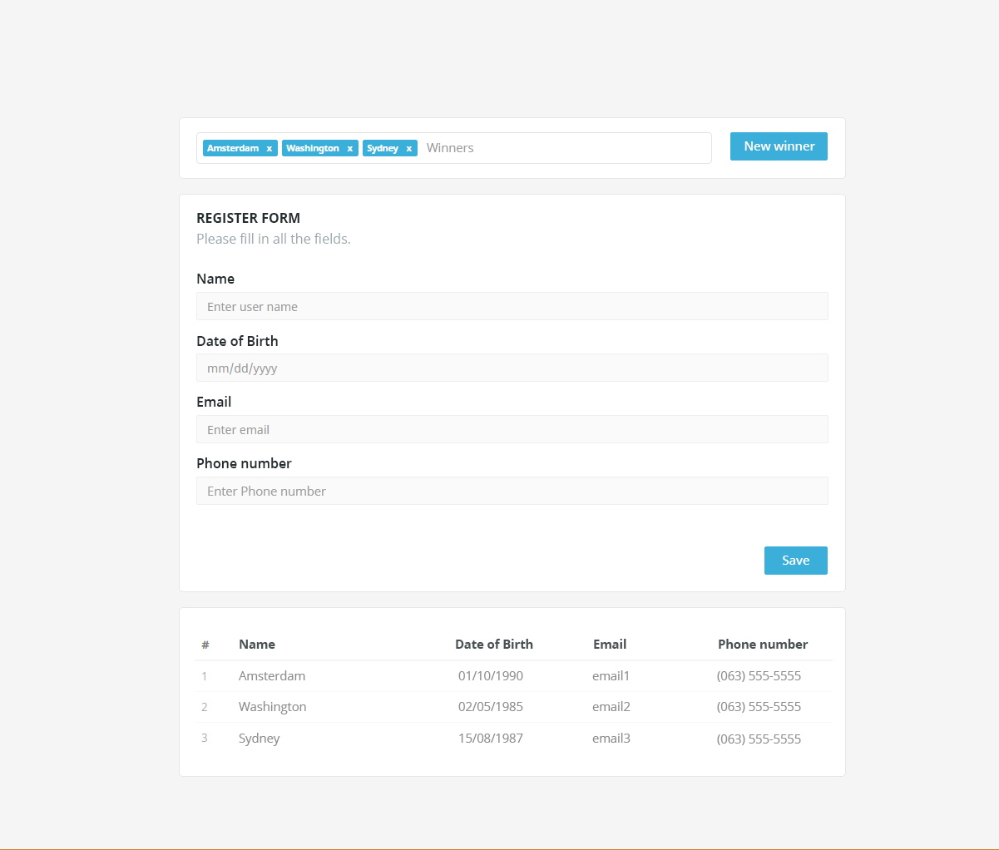

= Лабораторна робота №6

*Тема:* Основи роботи з компонентами: обчислювані властивості, обробка подій, прив'язування елементів форми

*Мета:* засвоїти основи роботи з компонентами у Vue.js, зокрема використання обчислюваних властивостей, обробки подій, та прив'язування елементів форми. Навчитися створювати інтерактивні компоненти, що реагують на дії користувача, управляють даними у формах та ефективно використовують реактивність через обчислювані властивості.

*Вимоги до звіту:*

. Лабораторна роба повинна бути виконана окремому github репозиторію студента, з назвою vue-lottery-app.
. Дотримання TypeScript-типізації;
. Використання Composition Api або Options Api на вибір студента;
. Під час написання застосунку, обов'язково дотримуватись https://ua.vuejs.org/style-guide/[style guide];
. Для стилізації використати один з css фреймворків: Bootstrap, Tailwindcss (обов'язково встановити через npm);
. Використовуйте Eslint;
. Заборонено використовувати alert для показу помилок юзеру.

== Практична частина

=== Самостійна робота студента:

. https://ua.vuejs.org/guide/typescript/overview.html[Typescript in vue];
. https://ua.vuejs.org/guide/typescript/options-api.html[Options Api];
. https://ua.vuejs.org/guide/typescript/composition-api.html[Composition Api];
. https://ua.vuejs.org/guide/essentials/computed.html[Обчислювані властивості];
. https://ua.vuejs.org/guide/essentials/event-handling.html[Обробка подій];
. https://ua.vuejs.org/guide/essentials/forms.html[Прив'язування елементів форми];
. https://ua.vuejs.org/guide/essentials/forms.html[Прив'язування елементів форми приклади];
. https://ua.vuejs.org/examples/#flight-booker[Прив'язування елементів форми приклади];
. https://ua.vuejs.org/examples/#crud[Прив'язування елементів форми приклади];

=== Завдання:

Створити застосунок лотерею. Лотерея повинна містити 3 блоки:

. Блок переможців;
. Блок з формою реєстрації нових учасників;
. Блок з таблицею зі списком учасників;

Форма реєстрації нових учасників:

. Всі полями є обов'язковими.
. Також необхідно перевірити правильність введеної інформації електронної пошти та телефону за regexp.
+

. Для поля з датою виокористовуйте https://developer.mozilla.org/en-US/docs/Web/HTML/Element/input/date[input date], додаткова стилізація календаря не потрібна. Формат дати yyyy-mm-dd. Дата народження не повинна бути у майбутньому, при цьому вивести юзеру помилку.
+

. Натиснувши кнопку «Save», необхідно додати учасника до таблиці - списку учасників та очистити форму реєстрації. При очищенні форми не повинна спрацьовувати валідація полів.
+

Реалізувати випадковий вибір переможців, натиснувши кнопку «New winner».

. Поле переможців повинно містити не більше трьох переможців.
. Зробити кнопку «New winner» не активною, якщо переможців є 3.
. Зробити кнопку «New winner» не активною, якщо список юзерів пустий.
. Реалізувати видалення переможців з блоку.

Порядок та стиль компонентів повинні виглядати так, майже як на дизайні.

